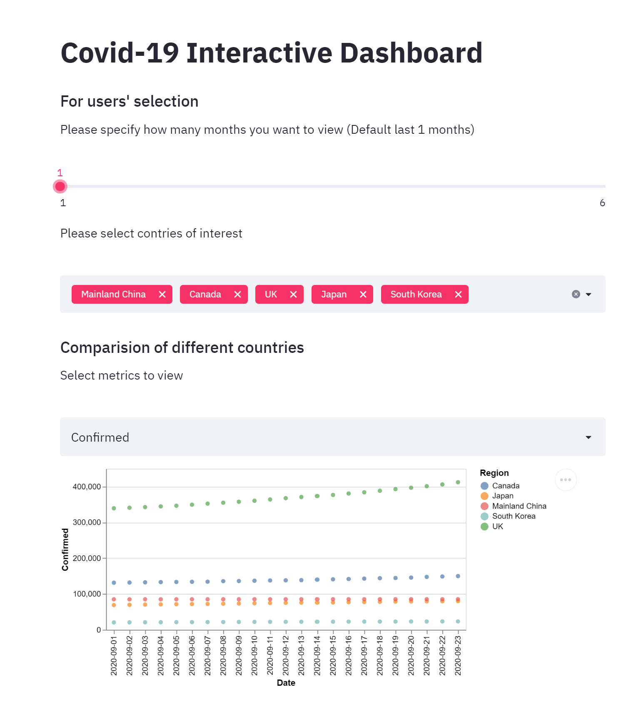

# Covid-19 Interactive Dashboard

## Project Goals

The goal of the project was to provide an interactive exploration of both the stastical impact and emotional impact of Covid-19. The decision came
from finding two datasets - one on health data and one on Twitter data. Instead of choosing a single dataset, we made the decision to incorporate both but with diverging exploratory techniques in order to facilitate better user interaction.

## Design

For the csv health dataset, there are three major visual encodings: country selection, correlation exploration and time series visuazalition. Since there are more than 50 countries in the dataset, it would be infeasible to display information for all countries in a single page; therefore, we include the country selection section. We also think that users will find by insights by exploring the correlations between either 2 of the three numerical features (confirmed, death and recovered).Also, the users can dive into the details of the points they interactively select in the figure. Finally, time seires feature is necessary for users to understand the trends. For alternatives, we considered including a world map using pydeck library, but it seems to take very long for the application to load, so we had to discard this feature.

The tweet dataset captured term frequency of tweets with Covid related hashtags over a 3 month period from January to March. Instead of using traditional visualization techniques from completely processed data, we thought it would be engaging for the user to perform their own processing. The primary visualization element is a wordcloud which simply sizes terms relative to their frequency in a given corpus. This is fairly straightforward, but most wordcloud packages only select the top N terms in order to keep their visual density low. We decided to let the user modify the word cloud by choosing a threshold frequency and filtering out stopwords. Common English and Spanish stopwords were provided as sidebar
options while additional stopwords could be custom-provided through the text input field. Under certain configurations, different tenses or forms of the same word would occupy a lot of the visual space in the word cloud. We provided the option for the user to choose to lemmatize the corpus. This improves the use of the visual space in the word cloud by filtering redundant forms. Finally a hidden bar graph provides a quantitave explanation of the frequency distribution of the word cloud.

## Development

Initial planning for this project began with both team members independently searching for datasets to use in the visualization. Biweekly meetings were held with regular cadence to provide updates and pass along information and problems found. Offline a common google doc was used to collect datasets. The project goal and design was formed when two of the datasets listed had overlap regarding coronavirus. Since both datasets were used, the project was easy to parallelize. Michael spent time working on the streamlit visualizations related to the healtcare dataset. Aditya focused on the natural language processing techniques used in the word cloud implementation. Once pieces of each visualization element were complete in their respective files, they were merged together in a final python script. At this point, both team members scrubbed through the dashboard in order to find edge cases and bugs in visualization settings. Most of the development time took place in finding the appropriate datasets and the APIs necessary for the advanced visualization elements. Certain additional elements had to be cut due to time and computational complexity which slowed down the entire application.
